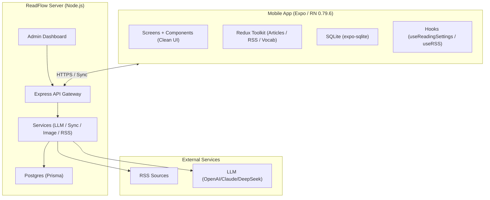
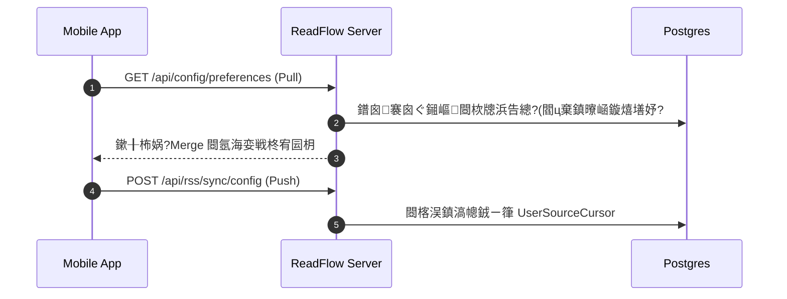

#  ReadFlow

ReadFlow 閺勵垯绔存總妞尖偓宀€些閸斻劎顏梼鍛邦嚢閸?+ 閼奉亜缂撴禍鎴狀伂閺堝秴濮熼妴宥勯獓閸濅緤绱?
- **ReadFlow App**閿涙岸娼伴崥?Android 閻?Expo / React Native RSS 闂冨懓顕扮€广垺鍩涚粩顖ょ礉閹绘劒绶电拋銏ゆ缁狅紕鎮婇妴浣圭焽濞寸绱￠梼鍛邦嚢閵嗕礁鍨濈拠宥囩倳鐠囨垯鈧浇鐦濆Ч鍥ь槻娑旂姰鈧胶顬囩痪璺ㄧ处鐎涙ê鎷版禍鎴濇倱濮濄儯鈧?- **ReadFlow Server**閿涙岸娼伴崥鎴ｅ殰閹垫顓搁柈銊ц閻?Node.js / Express 閺堝秴濮熺粩顖ょ礉鐠愮喕鐭?RSS 鐎规碍妞傞幎鎾冲絿閵嗕焦鏋冪粩鐘叉倱濮濄儯鈧礁娴橀悧鍥﹀敩閻炲棎鈧焦鐦￠弮?AI 閹芥顩﹂妴涓㎜M 缂冩垵鍙ч崪宀€顓搁悶鍡楁倵閸欒埇鈧?
<p align="left">
  <a href="https://reactnative.dev/"></a>
  <a href="https://expo.dev/"></a>
  <a href="https://www.typescriptlang.org/"></a>
  <a href="https://nodejs.org/"></a>
</p>

| 娴溠呭⒖ | 鐠侯垰绶?| 閸欐垵绔烽弬鐟扮础 | 娴ｆ粎鏁?|
| --- | --- | --- | --- |
| ReadFlow App閿涘湩eact Native / Expo閿?| `./src`, `./android` | `app-*` tag 鐟欙箑褰?GitHub Actions 閺嬪嫬缂?APK閿涘苯鑻熸稉濠佺炊閸?GitHub Release | 闂冨懓顕伴妴浣筋吂闂冨懌鈧礁顒熸稊鐘偓浣侯瀲缁惧灝鐡ㄩ崒銊ｂ偓渚€鐝幀褑鍏樺〒鍙夌厠 |
| ReadFlow Server閿涘湤ode/Express + Prisma/Postgres閿?| `./readflow-server` | 鐠囶厺绠熼悧鍫熸拱 tag 鐟欙箑褰?GitHub Actions 閺嬪嫬缂?GHCR 闂€婊冨剼閿涙瓪ghcr.io/virgooooox/readflowserver` | 娴滄垹顏弽绋跨妇閿涙俺顓荤拠浣风瑢閸氬本顒為妴浣告禈閻楀洣鍞悶鍡愨偓浣侯吀閻炲棗鎮楅崣鑸偓涓㎜M 缂冩垵鍙ч妴浣哥暰閺冭泛鍩涢弬?|

瑜版挸澧犵€广垺鍩涚粩顖滃閺堫剨绱癭10.0.4` / Android `versionCode 100004`閵嗗倸缍嬮崜宥嗘箛閸旓紕顏悧鍫熸拱閿涙瓪4.0.8`閵?
## 閻╊喖缍?
- [閺嶇绺鹃崝鐔诲厴娴滎喚鍋(#閺嶇绺鹃崝鐔诲厴娴滎喚鍋?
- [閺嬭埖鐎鏃囩箻](#閺嬭埖鐎鏃囩箻)
- [閸忔娊鏁ù浣衡柤](#閸忔娊鏁ù浣衡柤)
- [韫囶偊鈧喎绱戞慨濯?#韫囶偊鈧喎绱戞慨?
- [閻╊喖缍嶇紒鎾寸€痌(#閻╊喖缍嶇紒鎾寸€?
- [鐢瓕顫嗛梻顕€顣絔(#鐢瓕顫嗛梻顕€顣?

## 閺嶇绺鹃崝鐔诲厴娴滎喚鍋?
### 濞ｅ崬瀹抽梼鍛邦嚢娑撳骸顒熸稊?
- **閺嬩胶鐣?UI**閿涙岸鎷＄€靛綊妲勭拠璇插隘閸╃喍绱崠鏍畱閻ｅ矂娼伴敍宀勫櫚閻劎骞囨禒锝呭閻?Clean 鐠佹崘顓哥拠顓♀枅閵?- **濮ｅ繑妫╅幎銉ユ啞 (Daily Report)**閿涙艾鍩勯悽?LLM 閼奉亜濮╅悽鐔稿灇閸忋劌銇夌拋銏ゆ閺傚洨鐝烽惃鍕粵閸氬牓妲勭拠缁樺Г閸涘绱濈敮顔煎И韫囶偊鈧喐宕熼幑澶嬬壋韫囧啩鐜崐绗衡偓?- **閸掓帟鐦濋弻銉ㄧ槤娑撳海鐐曠拠?*閿涙氨鍋ｉ崙璇插礋鐠囧秴宓嗛崙娲櫞娑斿绱欓弨顖涘瘮鐠囧秴鑸版潻妯哄斧閿涘绱濋崣灞藉毊缂堟槒鐦ч崣銉ョ摍閿涘本澧嶉張澶嬬叀鐠囥垻绮ㄩ弸婊冩綆閸︺劍婀伴崷棰佺瑢娴滄垹顏崥灞绢劄缂傛挸鐡ㄩ妴?- **妤傛ɑ鈧嗗厴閸掓銆?*閿涙岸娉﹂幋?`@shopify/flash-list`閿涘苯婀崡鍐獓鐠併垽妲勫┃鎰瑓娓氭繄鍔ф穱婵囧瘮娑撴繃绮﹀姘З閵?
### 娴滄垹顏稉鈧担鎾冲 (ReadFlow Server)

- **娴滄垿鍘ょ純顔兼倱濮?*閿涙俺顓归梼鍛爱閵嗕礁鍨庣紒鍕┾偓浣界箖濠娿倛顫夐崚娆嶁偓渚€妲勭拠鏄忣啎缂冾喖婀幍鈧張澶岊伂閸楁洝鐨熼幒銊ㄧ箻閸氬本顒為敍鍫濈唨娴?`serverCursor` 鐠囶厺绠熼敍澶堚偓?- **LLM 缂冩垵鍙у▽鑽ゆ倞**閿涙碍婀囬崝锛勵伂缂佺喍绔寸拫鍐ㄥ LLM 閼宠棄濮忛敍灞炬暜閹镐胶鐛婇崣?閸掑棝鎸撶痪褔妾哄ù浣碘偓浣歌嫙閸欐垿妲﹂崚妤冾吀閻炲棔绗岀€孤ゎ吀閺冦儱绻旈妴?- **閸忣剙鍙￠崣鎴犲箛婢堆冨泛**閿涙艾鍞寸純?RSS 閸欐垹骞囬崝鐔诲厴閿涘苯褰插ù蹇氼潔楠炴湹绔撮柨顔款吂闂冨懎鍙曢崗杈ㄥ腹閼芥劗娈戞妯垮窛闁插繑绨妴?- **閸ュ墽澧栨禒锝囨倞娑撳酣顣╅悜?*閿涙岸鈧俺绻?`Sharp` 鏉╂稖顢戞妯烩偓褑鍏橀崶鍓у缂傗晜鏂侀妴浣圭壐瀵繗娴嗛幑顫礄WebP閿涘寮烽梼鑼磵闁炬儳鐓欓崥宥勫敩閻炲棎鈧?- **缁狅紕鎮婇崥搴″酱**閿涙氨娲跨憴鍌滄磧閹貉呴兇缂佺喓濮搁幀浣碘偓浣烘暏閹撮攱妞跨捄鍐ㄥ閸?LLM 濞戝牐鈧绮虹拋掳鈧?
## 閺嬭埖鐎鏃囩箻

妞ゅ湱娲板韫矤閳ユ粍婀伴崷棰佺喘閸忓牃鈧繆绻橀崠鏍﹁礋閳ユ粈绨粩顖濈ゴ閼宠В鈧繃鐏﹂弸鍕剁礉缁夊娅庢禍鍡樼€粻鈧禒锝囨倞閿涘苯宸遍崠鏍︾啊閺堝秴濮熺粩顖氭躬闁插秴鐎锋禒璇插閿涘牆鍩涢弬鑸偓浣叫掗弸鎰┾偓涓㎜M閵嗕椒鍞悶鍡礆娑撳﹦娈戦弨顖涙嫼閵?


## 閸忔娊鏁ù浣衡柤

### 1) 娴滄垹顏崥灞绢劄閿涘牐顓归梼?閸掑棛绮?鏉╁洦鎶ら敍?
缁崵绮洪柌鍥╂暏閸楁洝鐨熼柅鎺戭杻閻?`lastAckedArticleId` 娑?`serverCursor` 绾喕绻氶弫鐗堝祦娑撯偓閼峰瓨鈧嶇礉闁灝鍘ょ憰鍡欐磰瀵繑娲块弬鑸偓?


### 2) LLM 鐎孤ゎ吀娑撳酣妾哄ù?
閹碘偓閺堝鐓＄拠宥冣偓浣虹倳鐠囨垯鈧焦濮ら崨濠勬晸閹存劕娼庣紒蹇氱箖閺堝秴濮熺粩顖滅秹閸忕偨鈧?
```mermaid
sequenceDiagram
  autonumber
  participant A as App
  participant G as LLM Gateway
  participant Q as Global Queue
  participant E as External LLM

  A->>G: 鐠囬攱鐪伴弻銉ㄧ槤/缂堟槒鐦?  G->>G: 缁愪礁褰傞梽鎰ウ & 楠炶泛褰傛稉濠囨濡偓閺?  G->>Q: 鏉╂稑鍙嗘导妯哄帥缁狙囨Е閸?  Q->>E: 鐠嬪啰鏁ゅΟ鈥崇€?  E-->>G: 鏉╂柨娲栫紒鎾寸亯
  G->>A: 缂佹挻鐏?+ 濞戝牐鈧顓哥拋?```

## 韫囶偊鈧喎绱戞慨?
### 1. 閸氼垰濮╃粔璇插З缁?(App)

闁倸鎮庨張顒€婀寸拫鍐槸闂冨懓顕版稉搴㈡拱閸︾増膩瀵繋缍嬫灞烩偓?
```bash
npm install
npm run start
```

### 2. 闁劎璁查張宥呭缁?(readflow-server)

瀵櫣鍎撳楦款唴閸氼垳鏁ら張宥呭缁旑垯浜掗懢宄扮繁鐎瑰本鏆ｉ崝鐔诲厴閿涘牆鎮撳銉ｂ偓浣瑰Г閸涘鈧椒鍞悶鍡礆閵?
#### 娴ｈ法鏁?Docker (閹恒劏宕?
```bash
cd readflow-server
docker compose up -d --build
```

閻㈢喍楠囬梹婊冨剼閸欐垵绔烽崚?GitHub Container Registry閿?
```bash
docker pull ghcr.io/virgooooox/readflowserver:latest
docker pull ghcr.io/virgooooox/readflowserver:4.1.0
```

#### 閹靛濮╁鈧崣?```bash
cd readflow-server
npm install
npm run db:up      # 閸氼垰濮?DB
npm run db:migrate # 閸掓繂顫愰崠鏍€?npm run dev        # 閸氼垰濮╅崥搴ｎ伂
```

閺堝秴濮熺粩顖氭勾閸р偓姒涙顓婚敍姝歨ttp://localhost:3000`

## 閸欐垵绔?
- **閺堝秴濮熺粩顖炴殔閸?*閿涙碍甯归柅?`x.y.z` 閹?`vx.y.z` tag 閸氬函绱漙.github/workflows/docker-release.yml` 娴兼碍鐎鍝勮嫙閹恒劑鈧?`linux/amd64`閵嗕梗linux/arm64` 闂€婊冨剼閸?GHCR閵?- **Android APK**閿涙碍甯归柅?`app-x.y.z` tag 閸氬函绱漙.github/workflows/android-release.yml` 娴兼艾婀?GitHub Actions 娑擃厽鐎?release APK閿涘苯鑻熼幎?APK 闂勫嫬濮為崚鏉款嚠鎼?GitHub Release閵?- **閺堫剙婀撮弸鍕紦閼存碍婀?*閿涙瓪scripts/build-apk.js` 娣囨繃瀵旈張顒€婀撮弸鍕紦閸忋儱褰涢敍娑楃隘缁?APK 閸欐垵绔烽悽?GitHub Actions 鐠嬪啰鏁ら敍灞肩瑝闂団偓鐟曚焦鏁奸張顒€婀撮懘姘拱閵?
## 閻╊喖缍嶇紒鎾寸€?
```text
.
閳规壕鏀㈤埞鈧?android/            # Android 閸樼喓鏁撻柊宥囩枂
閳规壕鏀㈤埞鈧?assets/             # 闂堟瑦鈧浇绁┃?(Icon, Splash)
閳规壕鏀㈤埞鈧?readflow-server/    # 閺堝秴濮熺粩顖涚壋韫?(Express, Prisma, Admin)
閳?  閳规壕鏀㈤埞鈧?src/controllers/ # API 閹貉冨煑閸?閳?  閳规壕鏀㈤埞鈧?src/services/    # 閺嶇绺炬稉姘 (LLM, RSS, Sync)
閳?  閳规柡鏀㈤埞鈧?public/          # 缁狅紕鎮婇崥搴″酱闂堟瑦鈧浇绁┃?閳规壕鏀㈤埞鈧?src/                # 缁夎濮╃粩顖涚爱閻?閳?  閳规壕鏀㈤埞鈧?components/      # UI 缂佸嫪娆?(Clean UI)
閳?  閳规壕鏀㈤埞鈧?contexts/        # 閻樿埖鈧椒绗傛稉瀣瀮
閳?  閳规壕鏀㈤埞鈧?screens/         # 娑撴艾濮熸い鐢告桨
閳?  閳规壕鏀㈤埞鈧?services/        # 鐎广垺鍩涚粩?API 閺堝秴濮?閳?  閳规柡鏀㈤埞鈧?store/           # Redux 閻樿埖鈧胶顓搁悶?閳规柡鏀㈤埞鈧?App.tsx             # 閸忋儱褰涢弬鍥︽
```

## 鐢瓕顫嗛梻顕€顣?
- **婵″倷缍嶅鈧崥顖氭禈閻楀洣鍞悶鍡吹** 閸︺劎些閸斻劎顏垾婊嗩啎缂?- 闂冨懓顕扮拋鍓х枂閳ユ繀鑵戞繅顐㈠弳閼奉亜缂撻張宥呭缁旑垳娈戦崷鏉挎絻閿涘苯鑻熷鈧崥顖椻偓婊冩禈閻楀洣鍞悶鍡忊偓婵勨偓?- **婵″倷缍嶉悽鐔稿灇濮ｅ繑妫╅幎銉ユ啞閿?* 闂団偓閸︺劍婀囬崝锛勵伂闁板秶鐤嗛張澶嬫櫏閻?LLM API Key閿涘瞼閮寸紒鐔剁窗閼奉亜濮╅柅姘崇箖 Cron 娴犺濮熼幋鏍ㄥ閸斻劏袝閸欐垹鏁撻幋鎰┾偓?- **閺€顖涘瘮閸濐亙绨?RSS 閺嶇厧绱￠敍?* 閺€顖涘瘮閺嶅洤鍣?RSS 2.0, Atom, JSON Feed閵?