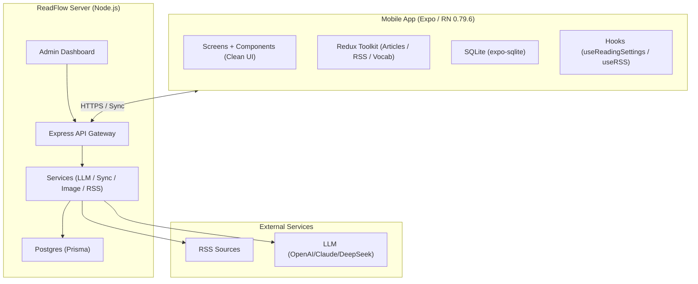
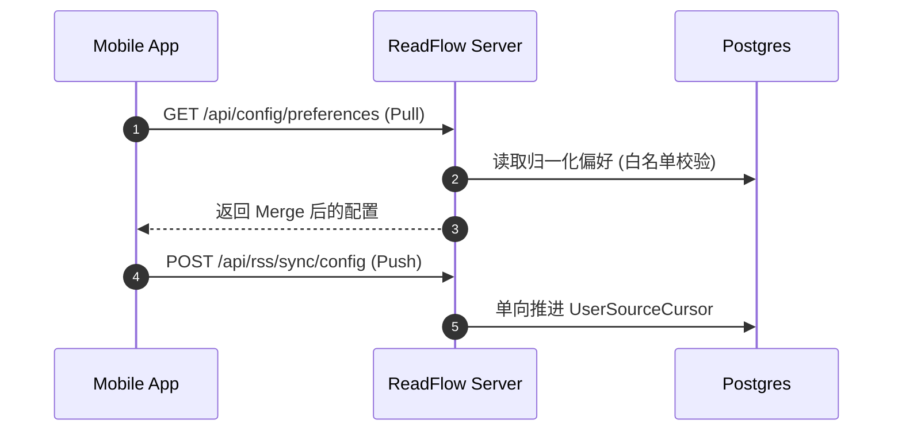
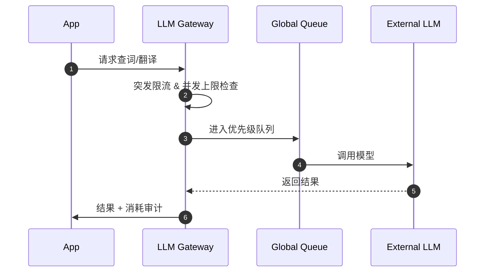

# ReadFlow

一款专注「深度阅读 + 英语学习」的移动端阅读器：RSS 订阅、沉浸式阅读、划词/翻译、每日报告（LLM）、词汇复习，以及自建服务端（云同步、图片代理、管理后台、LLM 网关）。

[](https://reactnative.dev/)
[](https://expo.dev/)
[](https://www.typescriptlang.org/)
[](https://nodejs.org/)

| 构件 | 路径 | 作用 |
| --- | --- | --- |
| App（React Native / Expo） | `./src` | 阅读、订阅、学习、离线存储、高性能渲染 |
| Server（Node/Express + Prisma/Postgres） | `./readflow-server` | 云端核心：认证与同步、图片代理、管理后台、LLM 网关、定时刷新 |

版本：`v6.1.1`（`app.json`） / `build 60101`（Android）


## 目录

- [核心功能亮点](#核心功能亮点)
- [架构演进](#架构演进)
- [关键流程](#关键流程)
- [快速开始](#快速开始)
- [目录结构](#目录结构)
- [常见问题](#常见问题)

## 核心功能亮点

### 深度阅读与学习

- **极简 UI**：针对阅读区域优化的界面，采用现代化的 Clean 设计语言。
- **每日报告 (Daily Report)**：利用 LLM 自动生成全天订阅文章的聚合阅读报告，帮助快速捕捉核心价值。
- **划词查词与翻译**：点击单词即出释义（支持词形还原），双击翻译句子，所有查询结果均在本地与云端同步缓存。
- **高性能列表**：集成 `@shopify/flash-list`，在千级订阅源下依然保持丝滑滚动。

### 云端一体化 (ReadFlow Server)

- **云配置同步**：订阅源、分组、过滤规则、阅读设置在所有端单调推进同步（基于 `serverCursor` 语义）。
- **LLM 网关治理**：服务端统一调度 LLM 能力，支持突发+分钟级限流、并发队列管理与审计日志。
- **公共发现大厅**：内置 RSS 发现功能，可浏览并一键订阅公共推荐的高质量源。
- **图片代理与预热**：通过 `Sharp` 进行高性能图片缩放、格式转换（WebP）及防盗链域名代理。
- **管理后台**：直观监控系统状态、用户活跃度及 LLM 消耗统计。

## 架构演进

项目已从“本地优先”进化为“云端赋能”架构，移除了极简代理，强化了服务端在重型任务（刷新、解析、LLM、代理）上的支撑。



## 关键流程

### 1) 云端同步（订阅/分组/过滤）

系统采用单调递增的 `lastAckedArticleId` 与 `serverCursor` 确保数据一致性，避免覆盖式更新。



### 2) LLM 审计与限流

所有查词、翻译、报告生成均经过服务端网关。



## 快速开始

### 1. 启动移动端 (App)

适合本地调试阅读与本地模式体验。

```bash
npm install
npm run start
```

### 2. 部署服务端 (readflow-server)

强烈建议启用服务端以获得完整功能（同步、报告、代理）。

#### 使用 Docker (推荐)
```bash
cd readflow-server
docker compose up -d --build
```

#### 手动开发
```bash
cd readflow-server
npm install
npm run db:up      # 启动 DB
npm run db:migrate # 初始化表
npm run dev        # 启动后端
```

服务端地址默认：`http://localhost:3000`

## 目录结构

```text
.
├── android/            # Android 原生配置
├── assets/             # 静态资源 (Icon, Splash)
├── readflow-server/    # 服务端核心 (Express, Prisma, Admin)
│   ├── src/controllers/ # API 控制器
│   ├── src/services/    # 核心业务 (LLM, RSS, Sync)
│   └── public/          # 管理后台静态资源
├── src/                # 移动端源码
│   ├── components/      # UI 组件 (Clean UI)
│   ├── contexts/        # 状态上下文
│   ├── screens/         # 业务页面
│   ├── services/        # 客户端 API 服务
│   └── store/           # Redux 状态管理
└── App.tsx             # 入口文件
```

## 常见问题

- **如何开启图片代理？** 在移动端“设置 - 阅读设置”中填入自建服务端的地址，并开启“图片代理”。
- **如何生成每日报告？** 需在服务端配置有效的 LLM API Key，系统会自动通过 Cron 任务或手动触发生成。
- **支持哪些 RSS 格式？** 支持标准 RSS 2.0, Atom, JSON Feed。
