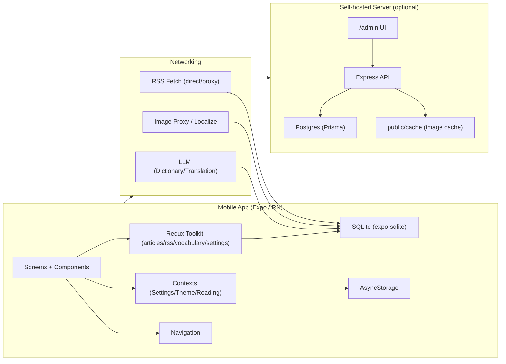
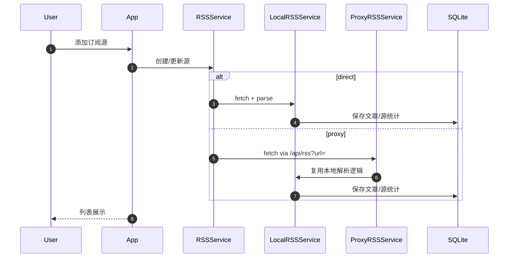
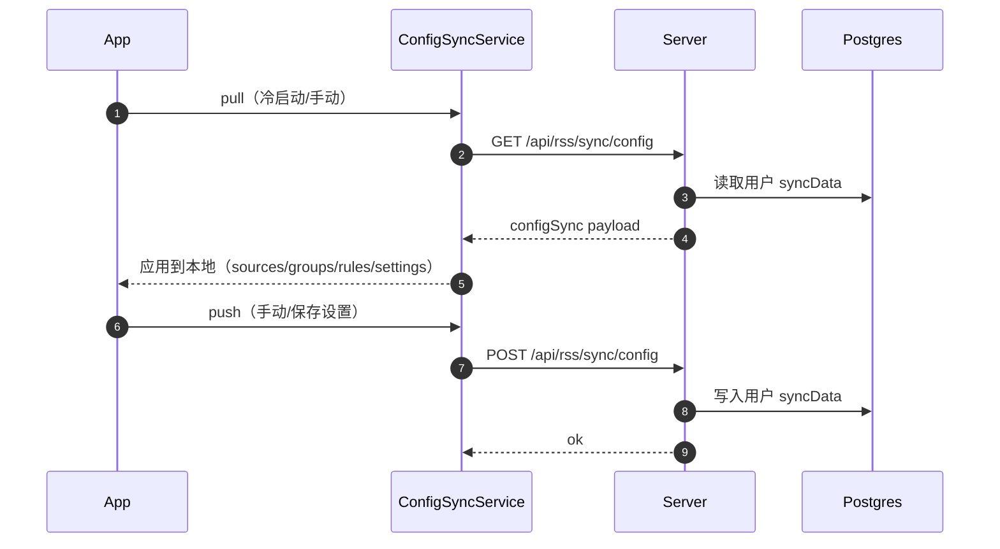

# ReadFlow

一款专注「深度阅读 + 英语学习」的移动端阅读器：RSS 订阅、沉浸式阅读、划词/翻译、词汇复习，以及可选的自建服务端（云同步、图片代理、管理后台）。

[](https://reactnative.dev/)
[](https://expo.dev/)
[](https://www.typescriptlang.org/)
[](https://nodejs.org/)

| 构件 | 路径 | 作用 |
| --- | --- | --- |
| App（React Native / Expo） | `./src` | 阅读、订阅、学习、离线存储、代理策略 |
| Server（Node/Express + Prisma/Postgres） | `./readflow-server` | 云模式：登录/注册、配置与订阅同步、图片代理、管理后台 |
| RSS 轻量代理（Go，可选） | `./server-go` | 极简代理：RSS 转发 + 图片代理（不含云同步/后台） |

版本：`v6.1.1`（`app.json`） / `build 60101`（Android）


## 目录

- [你能用它做什么](#你能用它做什么)
- [架构一图看懂](#架构一图看懂)
- [核心流程](#核心流程)
- [快速开始（仅客户端）](#快速开始仅客户端)
- [快速开始（云模式：自建服务端）](#快速开始云模式自建服务端)
- [快速开始（极简代理：Go 可选）](#快速开始极简代理go-可选)
- [配置速查](#配置速查)
- [目录结构](#目录结构)
- [常见问题](#常见问题)

## 你能用它做什么

### 阅读体验

- 极简 UI：压缩头部信息密度，阅读区域最大化
- 文章解析：直连 RSS +（可选）抓取全文并用 Readability 做正文提取
- 阅读进度：本地持久化，支持续读

### 学习引擎（LLM + 本地缓存）

- 划词查词：单词点击触发释义查询（支持词形还原，结果入库缓存）
- 双击翻译：句子级翻译（优先本地缓存，后备调用 LLM）
- 词汇本：新增/复习/统计（并可与自建服务端同步）

### 联网与同步（按需启用）

- 本地模式：所有数据落本机（SQLite + AsyncStorage）
- 云模式：账号体系 + 订阅/分组/过滤/设置同步 + 词汇同步 + 图片代理 + Web 管理后台
- 代理策略：对被墙/防盗链域名走代理（客户端与服务端都有配套能力）

## 架构一图看懂



## 核心流程

### 1) RSS 拉取与入库（直连 / 代理）



### 2) 云配置同步（订阅/分组/过滤/设置）



## 快速开始（仅客户端）

适合：不需要跨设备同步，不想部署服务端；RSS 直连为主。

```bash
npm install
npm run start
```

可用脚本（根目录 `package.json`）：

- `npm run start`：启动 Expo
- `npm run android` / `npm run ios`：本地原生运行（需要对应环境）
- `npm run build:apk`：构建 APK（封装脚本，详见 `scripts/build-apk.js`）

## 快速开始（云模式：自建服务端）

适合：跨设备同步、图片代理、后台管理、统一刷新策略。

### 方式 A：Docker 一键启动（推荐）

```bash
cd readflow-server
docker compose up -d --build
```

启动后：

- 健康检查：`GET http://localhost:3000/health`
- 后台页面：`http://localhost:3000/admin`

### 方式 B：本地开发启动

```bash
cd readflow-server
npm install
npm run db:up
npm run db:migrate
npm run dev
```

## 快速开始（极简代理：Go 可选）

适合：只想要 RSS/图片代理（不需要云同步/账号/后台）。

```bash
cd server-go
go run .
```

默认端口 `3000`，接口：

- `GET /api/rss?url=...`
- `GET /api/image?url=...`
- `GET /health`

## 配置速查

### App 侧（运行模式）

- 本地模式：`CloudConfig.mode = local`（不使用服务端）
- 云模式：`CloudConfig.mode = cloud` + `serverUrl`（使用自建服务端）
- 服务端访问码（可选）：`serverAccessKey`（对应服务端 `SERVER_TOKEN`）

### Server 侧（常用环境变量）

以下变量在 `readflow-server/docker-compose.yml` 中已有示例：

| 变量 | 说明 | 建议 |
| --- | --- | --- |
| `PORT` | 服务端端口 | 按需 |
| `DATABASE_URL` | Postgres 连接串 | 必配（云模式） |
| `ADMIN_PASSWORD` | 后台登录密码（`/admin`） | 必改 |
| `SERVER_TOKEN` | 访问码：限制客户端注册/连接 | 公开部署建议设置 |
| `JWT_SECRET` | JWT 签名密钥 | 公开部署必须设置强随机值 |
| `APP_BASE_URL` | 服务端对外基址（用于拼接图片代理 URL） | 反代场景建议设置 |

## 目录结构

```text
.
├─ src/                 # App：界面/导航/状态/服务
├─ readflow-server/      # 云模式服务端（Node/Express/Prisma）
├─ server-go/            # 可选：极简 RSS/图片代理（Go）
├─ android/              # RN Android 工程（Expo prebuild / run:android）
├─ assets/               # 图标、启动图等资源
└─ scripts/              # 构建脚本（APK 版本号/日志注入等）
```

## 常见问题

### 1) 我需要部署服务端吗？

不需要。只想本地阅读/学习时，直接运行 App 即可。需要跨设备同步/图片代理/后台管理时再启用云模式。

### 2) 服务端部署到公网需要注意什么？

- 修改 `ADMIN_PASSWORD`、设置强 `JWT_SECRET`
- 需要访问码就设置 `SERVER_TOKEN`（客户端需要填写对应的 Access Key）
- 建议用反向代理（HTTPS）并设置 `APP_BASE_URL`

