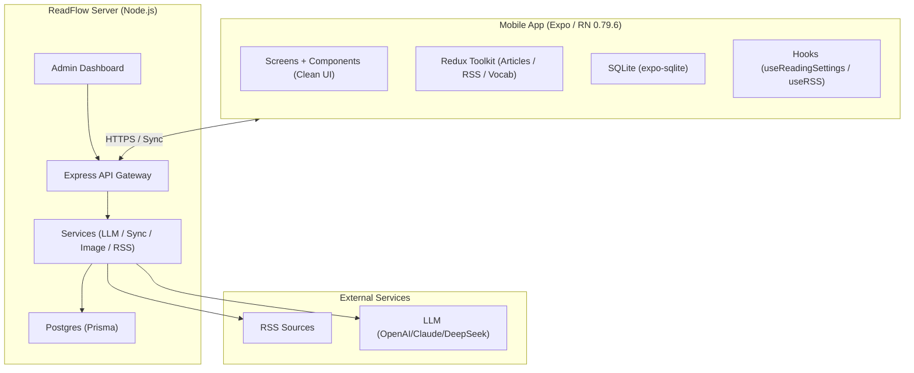
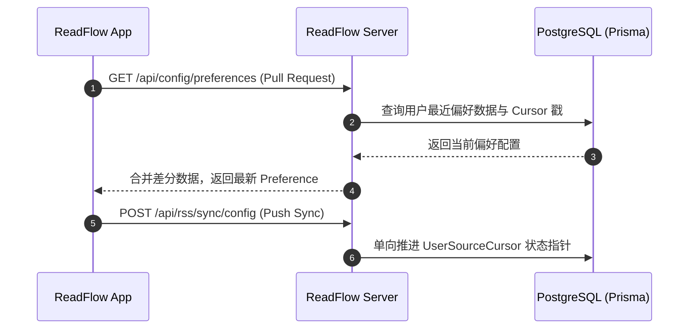
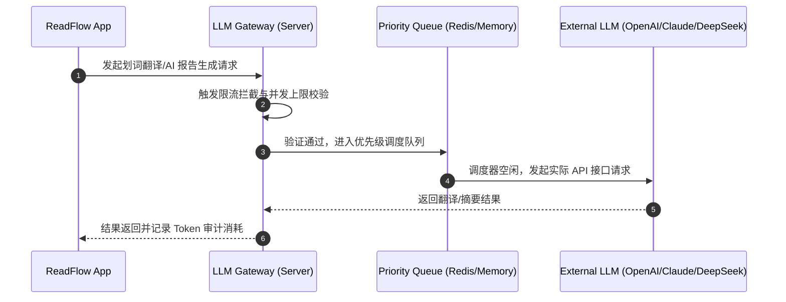

<p align="center">
  
</p>

<h1 align="center">ReadFlow 移动端阅读与自建云服务</h1>

<p align="center">
  <a href="https://reactnative.dev/">
    
  </a>
  <a href="https://nodejs.org/">
    
  </a>
  <a href="LICENSE">
    
  </a>
</p>

> **ReadFlow** 是一套专为深度阅读设计的**「移动端阅读客户端 + 自建云服务」**全栈产品。
>
> 核心理念是：通过自建云端服务（Node.js / Express）高效地抓取、解析 RSS 订阅源并进行 AI 智能摘要，同时利用基于 Expo/React Native 构建的高性能、极简移动端 App 提供跨平台阅读、划词翻译与离线生词本复习，彻底打破“信息过载”与“英文阅读障碍”。

---

## 📸 应用预览

### 1. 极简阅读列表与源管理
*展示干净清爽的文章列表，自动同步已读/未读状态与自定义分组。*


### 2. 每日 AI 摘要报告 (Daily Report)
*利用大型语言模型（LLM）对全天抓取的订阅文章进行聚合分类，生成可单手划读的 AI 合约阅读简报。*


### 3. 单词划词翻译与生词本
*阅读英文文章时，轻点单词弹出本地释义，双击翻译长句，并可一键加入生词本复习。*


---

## 🌟 核心特性

### 📱 ReadFlow App (移动端)
- 🎨 **极简现代 UI 体验**：针对移动设备阅读区域进行极致优化，去除一切冗余修饰，采用高对比度、呼吸感强的现代 Clean 设计语言，提供纯粹的沉浸式阅读体验。
- 📝 **每日 AI 摘要报告 (Daily Report)**：智能拉取服务端生成的全天订阅文章 AI 聚合报告，支持按分类与来源单手划动快速阅读，帮您在 3 分钟内抓取核心要点。
- 🔍 **智能划词查词与长句翻译**：轻点任意单词即可触发本地词典释义（支持智能词形还原、过去式/复数还原），双击或拖拽选择可调用 LLM 翻译整段长句。
- ⚡ **闪电般的滑动列表渲染**：基于 Shopify 开源的高性能列表组件 `@shopify/flash-list` 深度定制，即使订阅了上千条数据源，文章流的滚动依然能保持 60/120fps 的极致丝滑。
- 💾 **离线优先与本地 SQLite 缓存**：采用 `expo-sqlite` 作为本地数据库，所有已读/未读状态、收藏文章、查词历史及生词本均在本地进行持久化存储，联网后自动执行多端同步。

### 💻 ReadFlow Server (云端后台)
- 🔄 **单调递增 Cursor 高效同步**：基于自研 of 单向推进 `serverCursor` 协议与 `lastAckedArticleId` 指针，实现订阅源、分组、过滤规则及阅读偏好的高速增量同步，彻底杜绝数据覆盖冲突。
- 🛡️ **大模型网关治理与并发队列**：内置统一的 LLM (OpenAI / Claude / DeepSeek) 调度网关，支持请求按优先级排队、突发流量分钟级限流、故障熔断降级与敏感 Token 安全审计。
- 🌐 **防盗链图片代理与 WebP 压缩**：集成 `Sharp` 图像处理引擎，在服务端提供高速图片反防盗链代理，自动将原始图片裁剪、无损压缩并转换为现代 WebP 格式，大幅减少移动端流量开销。
- 🧭 **公共 RSS 发现大厅**：内置高质量 RSS 订阅源推荐与发现大厅，支持输入任意网页 URL 自动嗅探 RSS Feed 地址，并提供一键导入和源分类管理。
- 📊 **可视化系统管理后台**：提供直观的 Web 管理面板，可监控系统 CPU/内存占用、用户活跃度变化、RSS 抓取任务队列状态以及详细的 LLM Token 消耗统计。

---

## 🏗️ 架构与数据流向

### 1. 系统数据流向



### 2. 📂 项目目录结构规划

```text
readflow/
├── android/                    # Android 原生构建与权限配置
├── assets/                     # 静态资源 (应用图标、Splash 画面等)
├── src/                        # React Native / Expo 移动客户端源码
│   ├── components/             # 复用 UI 原子组件 (阅读面板、闪电列表、浮动词典等)
│   ├── contexts/               # 核心 React Contexts (全局状态、阅读设置、生词上下文)
│   ├── screens/                # 功能页面 (文章流、订阅管理、每日报告、生词本、设置页)
│   ├── services/               # 客户端 API 交互与本地数据服务
│   └── store/                  # Redux Toolkit 全局状态管理仓储 (Articles, RSS, Vocab)
├── readflow-server/            # Node.js / Express 云端服务源码
│   ├── prisma/                 # PostgreSQL 数据库 Schema 与迁移文件
│   ├── src/
│   │   ├── controllers/        # RESTful API 路由控制器 (Auth, RSS, Sync, LLM)
│   │   └── services/           # 核心系统服务 (RssFetch, LLMService, SyncService, ImageProxy)
│   └── public/                 # Web 管理后台静态资源与前端构建产物
├── scripts/                    # 辅助构建、自动化打包与迁移脚本
└── README.md                   # 本说明文件
```

---

## 🔄 核心业务流程

### 1. 云配置增量同步 (Sync Flow)
系统在拉取和同步配置时使用单向推进的 `serverCursor` 机制，降低移动端与服务器通信的数据包体积，避免多设备并发修改带来的覆盖冲突。



### 2. LLM 网关审计与限流 (LLM Gateway)
所有的划词查词、句子翻译以及每日 AI 报告生成，均统一由服务端的 LLM 网关中转。这保障了外部 Key 不泄漏，并能根据用户额度进行请求排队与频率限制。



---

## 🛠️ 构建与运行说明

### 1. 📱 移动端客户端启动 (ReadFlow App)
确保您已安装 Node.js (推荐 v20+) 并全局安装了 Expo CLI。

```bash
# 进入根目录并安装依赖
npm install

# 启动 Expo 临时开发服务器
npm run start
```
*在终端按下 `a` 可在连接 of Android 模拟器/真机上运行，按下 `i` 可在 iOS 设备运行。*

### 2. 💻 云端服务器部署 (ReadFlow Server)

#### 🐳 使用 Docker 一键运行 (推荐)
服务端提供了现成的 `docker-compose` 配置，包含 Express 后端与 PostgreSQL 数据库：

```bash
cd readflow-server

# 自动构建并启动服务 (后台运行)
docker compose up -d --build
```
您也可以从 GitHub Container Registry 拉取预编译的镜像：
```bash
docker pull ghcr.io/virgooooox/readflowserver:latest
```

#### 🛠️ 手动本地开发部署
如果您需要对服务端进行二次开发，请执行以下命令：

```bash
cd readflow-server

# 安装服务端依赖
npm install

# 启动本地 PostgreSQL 容器 (如果使用自备库可跳过)
npm run db:up

# 执行数据库迁移与 Schema 初始化
npm run db:migrate

# 启动 TypeScript 热重载开发服务器
npm run dev
```
启动成功后，服务端本地接口默认监听在 `http://localhost:3000`。

---

## 🚀 持续集成与打包发布

- **服务端 Docker 镜像发布**：当向主分支推送形如 `x.y.z` 或 `vx.y.z` 的语义化版本 Tag 时，GitHub Actions 会自动触发 `.github/workflows/docker-release.yml`，编译 `linux/amd64` 和 `linux/arm64` 双架构镜像，并将其发布至 GitHub Container Registry (GHCR)。
- **Android APK 原生编译**：推送 `app-x.y.z` 版本 Tag 将激活 `.github/workflows/android-release.yml`。GitHub Actions 会自动构建 release 版本的 APK 安装包，并将构建产物直接挂载到对应的 GitHub Release 中。
- **本地编译脚本**：您也可以在本地执行 `npm run build:apk` (基于 `scripts/build-apk.js`) 直接调用本地 Android SDK 环境编译测试版 APK。

---

## 🛡️ 数据隐私与安全政策

> [!IMPORTANT]
> **本地安全加密与 Token 保护**
>
> 用户的 LLM API Key、服务器连接凭据以及认证 Token **仅可安全存储在移动设备自带的硬件加密存储区**（基于 Expo SecureStore 桥接的 iOS Keychain / Android KeyStore），绝不落盘至普通 SQLite 数据库中。

> [!TIP]
> **服务端网关限流与脱敏**
>
> 服务端对所有对外的 LLM API 请求执行全局掩码与 Token 统计审计，防止敏感密钥在控制台日志（Console Log）中被明文打印。同时通过并发调度器限制各模块的并发查询频次，防御由于频繁翻译而导致的外部服务超额计费。

> [!WARNING]
> **环境变量与凭证提交安全**
>
> 本地开发期产生的所有私有配置文件（如 `readflow-server/.env`）、数据库会话及本地构建密钥已包含在根目录 [`.gitignore`](.gitignore) 中。**严禁**使用 git force 等指令强制将其提交到公共版本库，以免造成安全资产泄漏。

---

## 🙏 参考与致谢

- ReadFlow 在排版解析与正文提取上借鉴了 Mozilla 官方的 [@mozilla/readability](https://github.com/mozilla/readability) 设计精髓，并在 React Native (客户端) 及 Express (服务端) 中分别做了高性能渲染适配。
- 感谢 [@shopify/flash-list](https://github.com/Shopify/flash-list) 为超长 RSS 订阅流渲染所提供的革命性性能表现。

---

## 📋 非目标 (Non-Goals)
- 本项目不提供破解防爬限制、强行绕过内容提供商付费墙或破解非公开接口等功能。
- 定位为轻量深度阅读辅助工具，不包含任何带有社交属性的评论区、点赞广场或分享追踪。