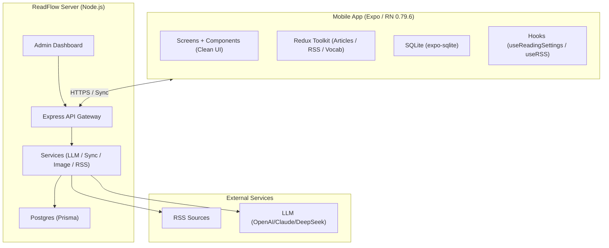
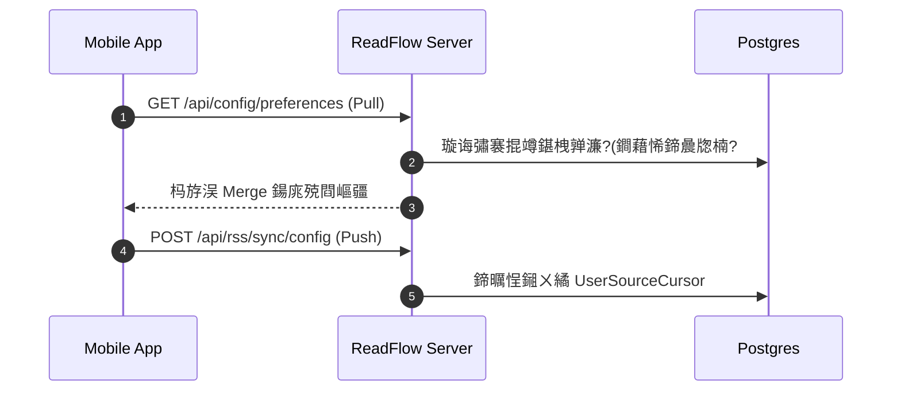

#  ReadFlow

ReadFlow 鏄竴濂椼€岀Щ鍔ㄧ闃呰鍣?+ 鑷缓浜戠鏈嶅姟銆嶄骇鍝侊細

- **ReadFlow App**锛氶潰鍚?Android 鐨?Expo / React Native RSS 闃呰瀹㈡埛绔紝鎻愪緵璁㈤槄绠＄悊銆佹矇娴稿紡闃呰銆佸垝璇嶇炕璇戙€佽瘝姹囧涔犮€佺绾跨紦瀛樺拰浜戝悓姝ャ€?- **ReadFlow Server**锛氶潰鍚戣嚜鎵樼閮ㄧ讲鐨?Node.js / Express 鏈嶅姟绔紝璐熻矗 RSS 瀹氭椂鎶撳彇銆佹枃绔犲悓姝ャ€佸浘鐗囦唬鐞嗐€佹瘡鏃?AI 鎽樿銆丩LM 缃戝叧鍜岀鐞嗗悗鍙般€?
<p align="left">
  <a href="https://reactnative.dev/"></a>
  <a href="https://expo.dev/"></a>
  <a href="https://www.typescriptlang.org/"></a>
  <a href="https://nodejs.org/"></a>
</p>

| 浜х墿 | 璺緞 | 鍙戝竷鏂瑰紡 | 浣滅敤 |
| --- | --- | --- | --- |
| ReadFlow App锛圧eact Native / Expo锛?| `./src`, `./android` | `app-*` tag 瑙﹀彂 GitHub Actions 鏋勫缓 APK锛屽苟涓婁紶鍒?GitHub Release | 闃呰銆佽闃呫€佸涔犮€佺绾垮瓨鍌ㄣ€侀珮鎬ц兘娓叉煋 |
| ReadFlow Server锛圢ode/Express + Prisma/Postgres锛?| `./readflow-server` | 璇箟鐗堟湰 tag 瑙﹀彂 GitHub Actions 鏋勫缓 GHCR 闀滃儚锛歚ghcr.io/virgooooox/readflowserver` | 浜戠鏍稿績锛氳璇佷笌鍚屾銆佸浘鐗囦唬鐞嗐€佺鐞嗗悗鍙般€丩LM 缃戝叧銆佸畾鏃跺埛鏂?|

褰撳墠瀹㈡埛绔増鏈細`10.0.4` / Android `versionCode 100004`銆傚綋鍓嶆湇鍔＄鐗堟湰锛歚4.0.8`銆?
## 鐩綍

- [鏍稿績鍔熻兘浜偣](#鏍稿績鍔熻兘浜偣)
- [鏋舵瀯婕旇繘](#鏋舵瀯婕旇繘)
- [鍏抽敭娴佺▼](#鍏抽敭娴佺▼)
- [蹇€熷紑濮媇(#蹇€熷紑濮?
- [鐩綍缁撴瀯](#鐩綍缁撴瀯)
- [甯歌闂](#甯歌闂)

## 鏍稿績鍔熻兘浜偣

### 娣卞害闃呰涓庡涔?
- **鏋佺畝 UI**锛氶拡瀵归槄璇诲尯鍩熶紭鍖栫殑鐣岄潰锛岄噰鐢ㄧ幇浠ｅ寲鐨?Clean 璁捐璇█銆?- **姣忔棩鎶ュ憡 (Daily Report)**锛氬埄鐢?LLM 鑷姩鐢熸垚鍏ㄥぉ璁㈤槄鏂囩珷鐨勮仛鍚堥槄璇绘姤鍛婏紝甯姪蹇€熸崟鎹夋牳蹇冧环鍊笺€?- **鍒掕瘝鏌ヨ瘝涓庣炕璇?*锛氱偣鍑诲崟璇嶅嵆鍑洪噴涔夛紙鏀寔璇嶅舰杩樺師锛夛紝鍙屽嚮缈昏瘧鍙ュ瓙锛屾墍鏈夋煡璇㈢粨鏋滃潎鍦ㄦ湰鍦颁笌浜戠鍚屾缂撳瓨銆?- **楂樻€ц兘鍒楄〃**锛氶泦鎴?`@shopify/flash-list`锛屽湪鍗冪骇璁㈤槄婧愪笅渚濈劧淇濇寔涓濇粦婊氬姩銆?
### 浜戠涓€浣撳寲 (ReadFlow Server)

- **浜戦厤缃悓姝?*锛氳闃呮簮銆佸垎缁勩€佽繃婊よ鍒欍€侀槄璇昏缃湪鎵€鏈夌鍗曡皟鎺ㄨ繘鍚屾锛堝熀浜?`serverCursor` 璇箟锛夈€?- **LLM 缃戝叧娌荤悊**锛氭湇鍔＄缁熶竴璋冨害 LLM 鑳藉姏锛屾敮鎸佺獊鍙?鍒嗛挓绾ч檺娴併€佸苟鍙戦槦鍒楃鐞嗕笌瀹¤鏃ュ織銆?- **鍏叡鍙戠幇澶у巺**锛氬唴缃?RSS 鍙戠幇鍔熻兘锛屽彲娴忚骞朵竴閿闃呭叕鍏辨帹鑽愮殑楂樿川閲忔簮銆?- **鍥剧墖浠ｇ悊涓庨鐑?*锛氶€氳繃 `Sharp` 杩涜楂樻€ц兘鍥剧墖缂╂斁銆佹牸寮忚浆鎹紙WebP锛夊強闃茬洍閾惧煙鍚嶄唬鐞嗐€?- **绠＄悊鍚庡彴**锛氱洿瑙傜洃鎺х郴缁熺姸鎬併€佺敤鎴锋椿璺冨害鍙?LLM 娑堣€楃粺璁°€?
## 鏋舵瀯婕旇繘

椤圭洰宸蹭粠鈥滄湰鍦颁紭鍏堚€濊繘鍖栦负鈥滀簯绔祴鑳解€濇灦鏋勶紝绉婚櫎浜嗘瀬绠€浠ｇ悊锛屽己鍖栦簡鏈嶅姟绔湪閲嶅瀷浠诲姟锛堝埛鏂般€佽В鏋愩€丩LM銆佷唬鐞嗭級涓婄殑鏀拺銆?


## 鍏抽敭娴佺▼

### 1) 浜戠鍚屾锛堣闃?鍒嗙粍/杩囨护锛?
绯荤粺閲囩敤鍗曡皟閫掑鐨?`lastAckedArticleId` 涓?`serverCursor` 纭繚鏁版嵁涓€鑷存€э紝閬垮厤瑕嗙洊寮忔洿鏂般€?


### 2) LLM 瀹¤涓庨檺娴?
鎵€鏈夋煡璇嶃€佺炕璇戙€佹姤鍛婄敓鎴愬潎缁忚繃鏈嶅姟绔綉鍏炽€?
```mermaid
sequenceDiagram
  autonumber
  participant A as App
  participant G as LLM Gateway
  participant Q as Global Queue
  participant E as External LLM

  A->>G: 璇锋眰鏌ヨ瘝/缈昏瘧
  G->>G: 绐佸彂闄愭祦 & 骞跺彂涓婇檺妫€鏌?  G->>Q: 杩涘叆浼樺厛绾ч槦鍒?  Q->>E: 璋冪敤妯″瀷
  E-->>G: 杩斿洖缁撴灉
  G->>A: 缁撴灉 + 娑堣€楀璁?```

## 蹇€熷紑濮?
### 1. 鍚姩绉诲姩绔?(App)

閫傚悎鏈湴璋冭瘯闃呰涓庢湰鍦版ā寮忎綋楠屻€?
```bash
npm install
npm run start
```

### 2. 閮ㄧ讲鏈嶅姟绔?(readflow-server)

寮虹儓寤鸿鍚敤鏈嶅姟绔互鑾峰緱瀹屾暣鍔熻兘锛堝悓姝ャ€佹姤鍛娿€佷唬鐞嗭級銆?
#### 浣跨敤 Docker (鎺ㄨ崘)
```bash
cd readflow-server
docker compose up -d --build
```

鐢熶骇闀滃儚鍙戝竷鍒?GitHub Container Registry锛?
```bash
docker pull ghcr.io/virgooooox/readflowserver:latest
docker pull ghcr.io/virgooooox/readflowserver:4.0.9
```

#### 鎵嬪姩寮€鍙?```bash
cd readflow-server
npm install
npm run db:up      # 鍚姩 DB
npm run db:migrate # 鍒濆鍖栬〃
npm run dev        # 鍚姩鍚庣
```

鏈嶅姟绔湴鍧€榛樿锛歚http://localhost:3000`

## 鍙戝竷

- **鏈嶅姟绔暅鍍?*锛氭帹閫?`x.y.z` 鎴?`vx.y.z` tag 鍚庯紝`.github/workflows/docker-release.yml` 浼氭瀯寤哄苟鎺ㄩ€?`linux/amd64`銆乣linux/arm64` 闀滃儚鍒?GHCR銆?- **Android APK**锛氭帹閫?`app-x.y.z` tag 鍚庯紝`.github/workflows/android-release.yml` 浼氬湪 GitHub Actions 涓瀯寤?release APK锛屽苟鎶?APK 闄勫姞鍒板搴?GitHub Release銆?- **鏈湴鏋勫缓鑴氭湰**锛歚scripts/build-apk.js` 淇濇寔鏈湴鏋勫缓鍏ュ彛锛涗簯绔?APK 鍙戝竷鐢?GitHub Actions 璋冪敤锛屼笉闇€瑕佹敼鏈湴鑴氭湰銆?
## 鐩綍缁撴瀯

```text
.
鈹溾攢鈹€ android/            # Android 鍘熺敓閰嶇疆
鈹溾攢鈹€ assets/             # 闈欐€佽祫婧?(Icon, Splash)
鈹溾攢鈹€ readflow-server/    # 鏈嶅姟绔牳蹇?(Express, Prisma, Admin)
鈹?  鈹溾攢鈹€ src/controllers/ # API 鎺у埗鍣?鈹?  鈹溾攢鈹€ src/services/    # 鏍稿績涓氬姟 (LLM, RSS, Sync)
鈹?  鈹斺攢鈹€ public/          # 绠＄悊鍚庡彴闈欐€佽祫婧?鈹溾攢鈹€ src/                # 绉诲姩绔簮鐮?鈹?  鈹溾攢鈹€ components/      # UI 缁勪欢 (Clean UI)
鈹?  鈹溾攢鈹€ contexts/        # 鐘舵€佷笂涓嬫枃
鈹?  鈹溾攢鈹€ screens/         # 涓氬姟椤甸潰
鈹?  鈹溾攢鈹€ services/        # 瀹㈡埛绔?API 鏈嶅姟
鈹?  鈹斺攢鈹€ store/           # Redux 鐘舵€佺鐞?鈹斺攢鈹€ App.tsx             # 鍏ュ彛鏂囦欢
```

## 甯歌闂

- **濡備綍寮€鍚浘鐗囦唬鐞嗭紵** 鍦ㄧЩ鍔ㄧ鈥滆缃?- 闃呰璁剧疆鈥濅腑濉叆鑷缓鏈嶅姟绔殑鍦板潃锛屽苟寮€鍚€滃浘鐗囦唬鐞嗏€濄€?- **濡備綍鐢熸垚姣忔棩鎶ュ憡锛?* 闇€鍦ㄦ湇鍔＄閰嶇疆鏈夋晥鐨?LLM API Key锛岀郴缁熶細鑷姩閫氳繃 Cron 浠诲姟鎴栨墜鍔ㄨЕ鍙戠敓鎴愩€?- **鏀寔鍝簺 RSS 鏍煎紡锛?* 鏀寔鏍囧噯 RSS 2.0, Atom, JSON Feed銆?